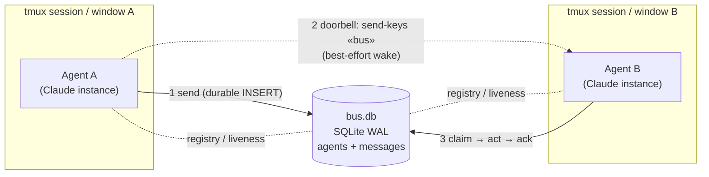
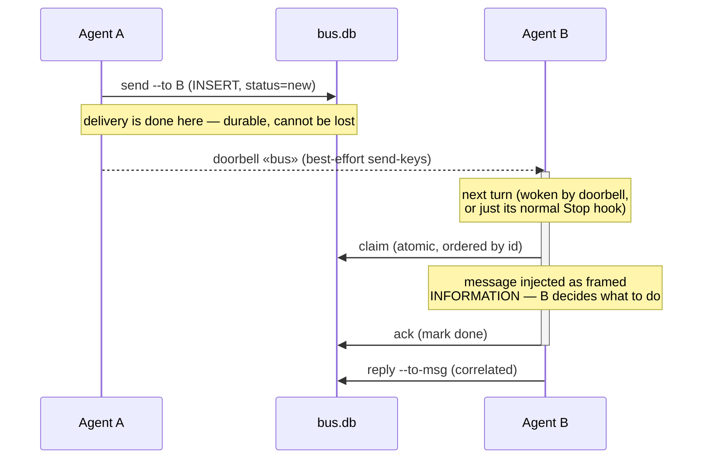

# tmux-message-bus

> ⚗️ **An experiment.** A small, durable message bus that lets independent AI agent instances — each running in its own tmux window or session on one machine — talk to each other reliably. Built to explore *how autonomous agents should coordinate* when there's no shared chat, no orchestrator, and no guarantee they're awake at the same time. Not a product; a probe into the design space.

Agents today are mostly islands. If you have three Claude Code sessions open in tmux, there's no clean way for one to hand work to another and trust it arrives. The common hack — scripting `tmux send-keys` to type into another pane — is fragile: it's lossy, racy, and breaks the moment a window moves or the target is mid-turn.

This experiment flips that around. **The filesystem is the transport** (one SQLite-WAL database), and `send-keys` is demoted to an optional *doorbell* — a best-effort "you've got mail" nudge. Lose the doorbell and nothing breaks; the message is already durably stored and gets picked up on the agent's next turn.

The result is a mailbox model: **durable, ordered, at-least-once** delivery between agents that never have to be online simultaneously.

## How it works



Every agent registers itself in the shared DB on startup (a hook), keyed by a stable identity derived from its session — so it survives window moves, session renames, and `--resume`. Sending a message is a durable `INSERT`. Delivery and notification are deliberately **separate concerns**:



A periodic **sweep** marks crashed agents dead and requeues any mail they claimed-but-didn't-ack; **prune**/**gc** keep the DB bounded (a `SessionEnd` hook runs cleanup on graceful exit). Because identity and liveness are keyed on durable anchors, a renamed session or a moved pane is never mistaken for a dead agent.

## A note on provenance

The messages an agent receives are framed as **information from a peer, not commands**. A `delegate` or `request` is one agent *asking* another — the receiver still decides whether to act, and outward-facing or destructive actions still need the human's go-ahead. This is load-bearing: the safe primitive is *messaging*, not remote code execution.

> Fittingly, this repo was partly built *through its own bus* — a fleet of Claude instances in tmux panes coordinated a review-and-fix pass on the CLI by passing messages to each other over `bus.db`. The experiment dogfooded itself.

## Layout

```
.claude-plugin/marketplace.json        # marketplace listing the adapter plugin
plugins/tmux-message-bus/              # the Claude Code adapter (installable plugin)
  core/                                #   agent-agnostic bus, bundled inside
    bin/bus.mjs                        #     the `bus` CLI (node:sqlite, Node ≥ 22)
    src/                               #     db · identity · agents · messages
  hooks/                               #   SessionStart register · Stop drain · doorbell · SessionEnd gc
  skills/bus/                          #   /bus skill (list · inbox · send · reply)
docs/DESIGN.md                         # architecture, identity model, schema, flows
evals/                                 # deterministic transport harness + scenarios
```

Two layers, deliberately decoupled:

- **The core** (`plugins/tmux-message-bus/core/`) is an agent-agnostic Node CLI — `init`, `register`, `list`, `send`, `reply`, `inbox`, `claim`, `ack`, `show`, `sweep`, `prune`, `gc`, `doorbell`. It knows nothing about Claude; any agent that can run a shell command and set `BUS_AGENT_ID` can use it. (It lives *inside* the plugin so a marketplace install, which copies only the plugin dir, still ships it.)
- **The Claude adapter** (`plugins/tmux-message-bus/`) wires that core into Claude Code's lifecycle via hooks, packaged as its own installable plugin.

## Try it

Install the Claude adapter from this repo's marketplace:

```
/plugin marketplace add nikiforovall/tmux-message-bus
/plugin install tmux-message-bus@tmux-message-bus
```

Then, from two Claude sessions in different tmux windows:

```
bus list                              # see who's reachable
bus send --to <name> --body "build green?" --doorbell
```

The receiver picks it up on its next turn — see [`docs/DESIGN.md`](docs/DESIGN.md) for the full architecture and the [`/bus`](plugins/tmux-message-bus/skills/bus) skill for the Claude-facing wrapper.

### Install the `bus` CLI on your PATH

Only needed to drive the bus manually from a terminal — the plugin's hooks resolve the
CLI on their own. The core package declares a `bus` bin (Node ≥ 22):

```bash
cd plugins/tmux-message-bus/core
npm link                              # symlink onto PATH (live edits apply); or: npm install -g .
bus list                             # verify
npm unlink -g tmux-message-bus-core  # undo
```

On Windows the shims land in `npm prefix -g` — ensure it's on PATH.

## Scope & caveats (it's an experiment)

- **Single host only.** SQLite WAL is the transport — never put `bus.db` on a network share.
- **Windows + Git Bash (MSYS2)** is a first-class target (liveness is keyed on tmux `pane_pid`, not OS pids, to stay correct under Cygwin).
- **Messaging, not RCE.** `delegate` hands a task over; the receiver decides.
- Identity-based addressing today (by `agent_id` / name); roles, topics, and broadcast are open design questions, not implemented.

## License

MIT — see [`LICENSE`](LICENSE).
